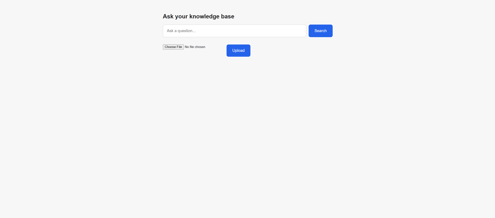
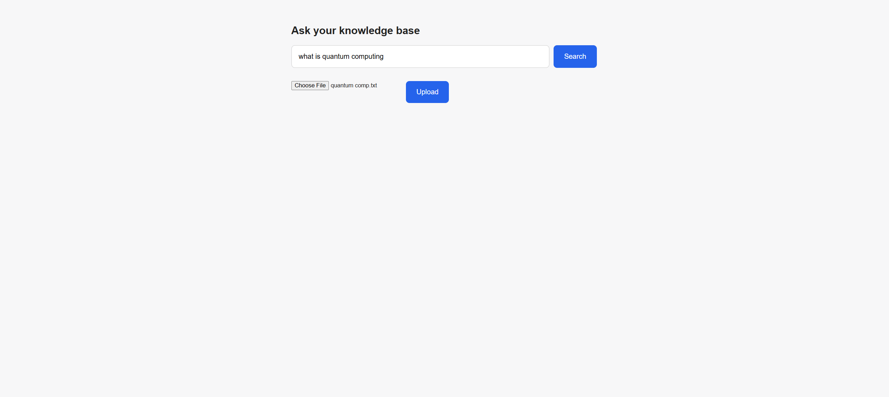
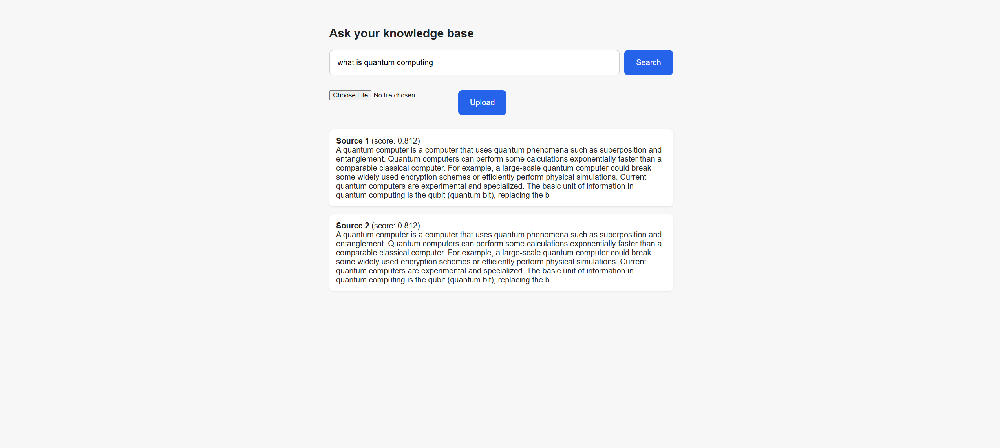

# AI Knowledge Base

**[Live Demo](https://ai-knowledge-base-ttz8.onrender.com/)**

A semantic search app that lets you ask questions over your own notes/documents using AI embeddings — instead of keyword matching, it finds content based on meaning.

## What it does
Upload notes or documents, ask questions in plain English, and receive the most relevant passages ranked by semantic similarity with AI-powered search.

## How it works
1. Documents are split into chunks
2. Each chunk is converted into a vector embedding using a sentence-transformer model (`all-MiniLM-L6-v2`)
3. Embeddings are stored in a SQLite database
4. When you search, your query is embedded the same way and compared against all stored chunks using cosine similarity
5. The most relevant chunks are returned, ranked by score

## Tech stack
- Python, Flask
- sentence-transformers (Hugging Face)
- SQLite
- HTML/CSS

## Why I built it
I wanted to learn how semantic search and AI retrieval systems work beyond simple keyword matching and understand the core concepts behind RAG applications.

## What I'd improve with more time
- Smarter chunking (sentence/paragraph boundaries instead of fixed character count)
- Hybrid search (keyword + semantic)
- Support for uploading multiple file types (PDF, markdown)

## Evaluation
I built a small evaluation set of 5 question/answer pairs to test retrieval accuracy. Running `python -m app.evaluate` checks whether the correct information appears in the top 2 retrieved chunks for each question.

**Result: 100% accuracy (5/5)**

## Running it locally
\`\`\`bash
pip install -r requirements.txt
python -m core.ingest
python app.py
\`\`\`